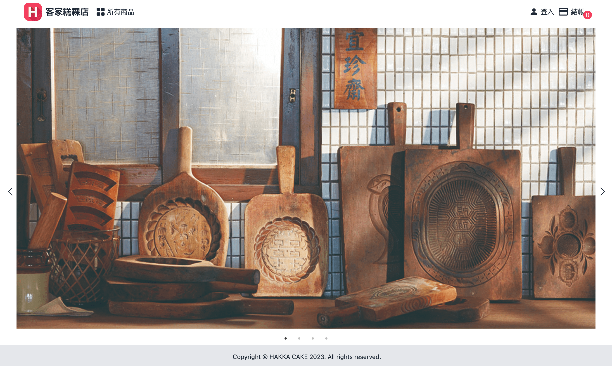
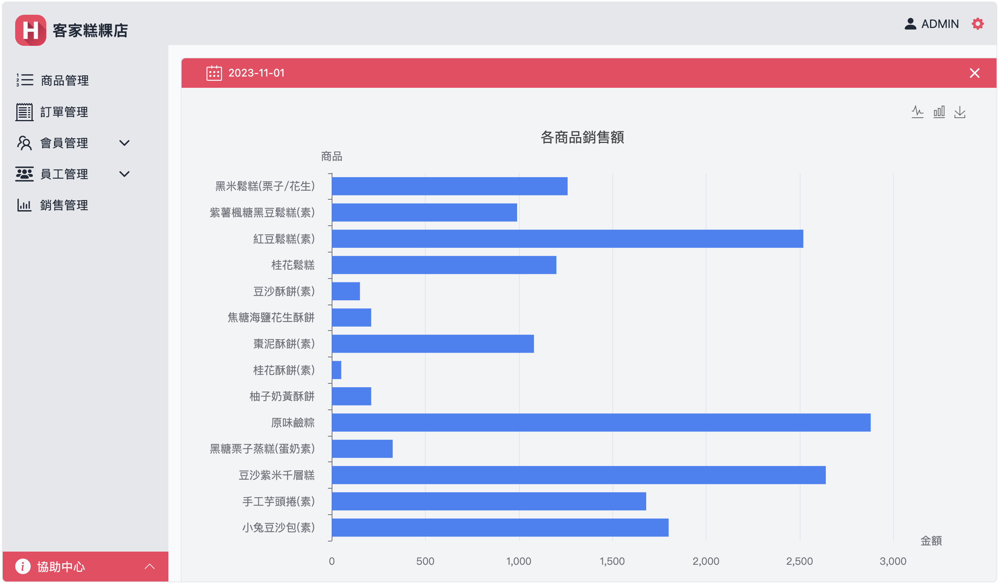

<div align="center">


# 客家糕粿店 - 網站全端專案
</div>

> ⚠ 測試請同時下載前、後台資料包 : <br>
Frontend --> https://github.com/Jam-Peng/hakka_cake_shop_frontend <br>
Backend --> https://github.com/Jam-Peng/hakka_cake_shop_backend
###  Preview :

<table width="100%"> 
<tr>
<td width="50%">      
&nbsp; 
<br>
<p align="center">
  Frontend | Home
</p>
<center>

</td>

<td width="50%">
<br>
<p align="center">
  Backend | Chart
</p>
<center>

</td>
</tr>
</table>

#

## 設計動機
- 幫舅舅的客家手作糕點設計一個網路商店與後台管理系統。
- 使用 Django 撰寫 API 將前、後端做資料的整合與應用。
- <a href="https://drive.google.com/file/d/1MIN3X9e8rf6s-wNaw6T52tyrQcTn7GsT/view?usp=sharing" target="_blank">開啟線上完整專案介紹</a>


#
### 使用環境
- `Python-3`。

---
### 使用技術
- 以 `Django` 框架開發。
- 使用 `Django REST framework (DRF)` 建立、發布與管理 Web API，建立序列化器 (serializer) 轉換 JSON 格式，路由匯入 DefaultRouter 管理 API URL，視圖 (views) 使用 viewsets 和 APIView 根據功能需求的不同，設定適合使用的 API 方式。
- 使用 `Django REST framework SimpleJWT` 設定使用者登入時接收 JSON Web Token 執行身份的驗證及根據 refresh token 自動發送更新 JWT 。

### 使用套件
- `django`
- `django-cors-headers`
- `djangorestframework`
- `djangorestframework-simplejwt`
- `Pillow`
- `uuid`
- `datetime`


## 如何執行 - `前、後台`
--> 使用 Zip 下載專案或使用下面的指令下載
```bash
git clone https://github.com/Jam-Peng/hakka_cake_shop_frontend

git clone https://github.com/Jam-Peng/hakka_cake_shop_backend
```

--> 進入前台資料包
```bash
cd frontend
```

--> 或進入後台資料包
```bash
cd backendend
```

--> 安裝專案需求 dependencies
```bash
npm install
```

--> 執行專案
```bash
npm run start
```

## 如何執行 - `伺服器`
--> 使用 Zip 下載專案或使用下面的指令下載
```bash
git clone https://github.com/Jam-Peng/hakka_cake_shop_server.git
```

--> 進入server資料包
```bash
cd server
```

--> 建立虛擬環境
```bash
conda create --name venv python=3.9
```

--> 執行虛擬環境
```bash
conda activate venv
```

--> 安裝套件
```bash
pip install -r requirements.txt
```

--> 數據庫遷移
```bash
python manage.py makemigrations
python manage.py migrate
```

--> 運行伺服器
```bash
python manage.py runserver
```
